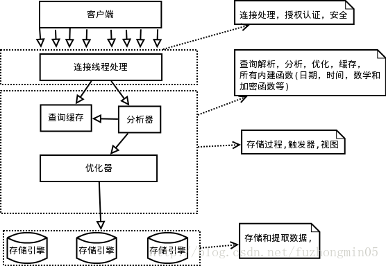

# Mysql入门
## 1.Mysql逻辑架构

MySQL逻辑架构整体分为三层，最上层为客户端层，并非MySQL所独有，诸如：连接处理、授权认证、安全等功能均在这一层处理。

MySQL大多数核心服务均在中间这一层，包括查询解析、分析、优化、缓存、内置函数(比如：时间、数学、加密等函数)。所有的跨存储引擎的功能也在这一层实现：存储过程、触发器、视图等。

最下层为存储引擎，其负责MySQL中的数据存储和提取。和Linux下的文件系统类似，每种存储引擎都有其优势和劣势。中间的服务层通过API与存储引擎通信，这些API接口屏蔽了不同存储引擎间的差异。

每个客户端发起的请求都由服务端的连接/线程处理工具负责接收客户端的请求并开辟一个新的内存空间，在服务器端的内存中生成一个新的线程，当一个用户连接到服务器端的时候就会在进程地址空间生成一个新的线程用于响应客户端请求，用户发起的查询请求都在线程空间内运行，结果也在这里缓存并返回给服务器端。

线程的重用和销毁都是由连接/线程管理器实现的。

## 2.并发控制
无论何时，只要有多个查询需要在同一时刻修改数据，都会产生并发控制的问题。Mysql的并发控制方案：
+ 读写锁。

同一时刻多读少写场景。通过实现读写锁来实现。

+ 锁粒度。

尽量只锁定需要修改的部分数据，而不是所有的资源。但是加锁也是需要消耗资源的。所以锁策略就是在锁的开销和数据的安全性之间寻求平衡。Mysql提供了多种存储引擎都可以实现自己的所策略和锁粒度。

+ 表锁

表锁是Mysql中最基本的锁策略，并且是开销最小的策略。它会锁定整张表。然后阻塞其他用户对该表的所有读写操作。

+ 行级锁

行级锁可以最大程度地支持并发处理（同时也带来最大的锁开销）。InnoDB以及XtraDB就是实现了行级锁。

+ 多版本并发控制

Mysql的大多数事务型存储引擎实现的都不是简单的行级锁。基于提升并发性能的考虑，他们一般都同时实现了多版本并发控制（MVCC）。MVCC的实现，是通过保存数据在某个时间点的快照来实现的。也就是说，不管需要执行多长时间，每个事务看到的数据都是一致的。InnoDB的MVCC是通过在每行记录后面保存两个隐藏的列来实现的。这两个列，一个是保存了行的创建时间，一个保存行的过期时间。存储的并不是实际值，而是系统版本号。每开始一个新的事务，系统版本号就会自动递增。事务开始时刻的系统版本号会作为事务的版本号，用来和查询到的每行记录的版本号进行比较。
## 3.Mysql存储引擎
### 3.1InnoDB存储引擎。
InnoDB采用MVCC来支持高并发，并实现了四个标准的隔离级别。其默认的级别是REPEATABLE READ（可重复读），并且通过间隙锁策略防止幻读的出现。

InnoDB表是基于聚簇索引简历的。聚簇索引对主键查询有很高的性能。不过他的二级索引（非主键索引）中必须包含主键列，所以主键很大的话，其他的所有索引都会很大。

InnoDB通过一些机制和工具支持热备份，其他的存储引擎不支持。

### 3.2 MyISAM存储引擎
MyISAM提供了全文索引、压缩、空间函数等。

MyISAM不支持事务和行级锁。

MyISAM的缺陷是崩溃后无法安全恢复。（MyISAM只将数据写到内存中，然后等待操作系统定期将数据刷到磁盘上）
