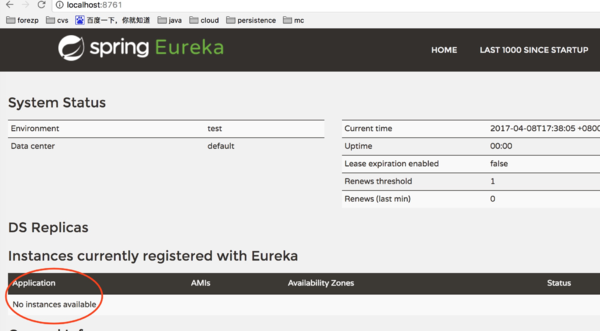
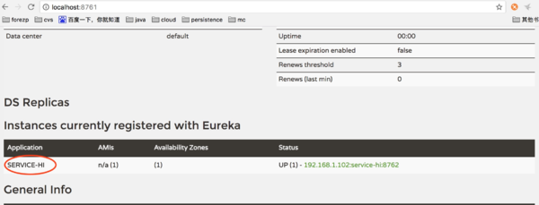

**目录** 

+ [服务治理](#服务治理)
+ [创建服务注册中心](#创建服务注册中心)
+ [创建服务提供者](#创建服务提供者)
+ [高可用服务注册中心](#高可用注册中心)
+ [Eureka详解](#Eureka详解)

# 服务治理：Spring Cloud Eureka

Spring Cloud Eureka是Spring Cloud Netflix微服务套件中的一部分，它基于Netflix Eureka做了二次封装，主要负责完成微服务架构中的服务治理功能。
## 服务治理
服务治理是微服务架构中最为核心和基础的模块，它主要用来实现各个微服务实例的自动化注册和发现。
### 服务注册
在服务治理框架中，通常会构建一个注册中心，每个服务单元向注册中心登记自己提供的服务，将主机与端口、版本号、通信协议等一些附加信息告知注册中心，注册中心按照**服务名**组织服务清单。并且服务注册中心还需要以**心跳**的方式去监测清单中的服务是否可用，若不可用需要从服务清单中剔除，达到排除故障的效果。

|服务名|位置|
| ------ | ------|
|服务A|192.168.1.1:8000、192.168.1.2:8001|
|服务B|192.168.1.3:8003、192.168.1.4:8004|

#### 服务发现
由于在服务治理框架下运作，服务间的调用不再通过指定具体的实例地址来实现，而是通过向服务名发起请求调用实现。所以，服务调用方在调用服务提供方接口的时候，并不知道具体的实例位置。因此，调用方需要向服务注册中心咨询服务，并获取所有服务的实例清单，以实现对具体服务实例的访问。
## 创建服务注册中心

* 创建Maven项目，并引入一下pom

```xml
<?xml version="1.0" encoding="UTF-8"?>
<project xmlns="http://maven.apache.org/POM/4.0.0" xmlns:xsi="http://www.w3.org/2001/XMLSchema-instance" xsi:schemaLocation="http://maven.apache.org/POM/4.0.0 http://maven.apache.org/xsd/maven-4.0.0.xsd">
    <parent>
        <artifactId>mermaid-framework-parent</artifactId>
        <groupId>com.mermaid.framework</groupId>
        <version>1.0-SNAPSHOT</version>
    </parent>
    <modelVersion>4.0.0</modelVersion>
    <artifactId>mermaid-eureka-server</artifactId>
    <name>mermaid-eureka-server</name>
    <properties>
        <project.build.sourceEncoding>UTF-8</project.build.sourceEncoding>
        <maven.compiler.source>1.7</maven.compiler.source>
        <maven.compiler.target>1.7</maven.compiler.target>
    </properties>
    <dependencies>
        <dependency>
            <groupId>org.springframework.cloud</groupId>
            <artifactId>spring-cloud-starter-eureka-server</artifactId>
        </dependency>
    </dependencies>
    <dependencyManagement>
        <dependencies>
            <dependency>
                <groupId>org.springframework.cloud</groupId>
                <artifactId>spring-cloud-dependencies</artifactId>
                <version>Dalston.RELEASE</version>
                <type>pom</type>
                <scope>import</scope>
            </dependency>
        </dependencies>
    </dependencyManagement>
</project>
```

* 启动一个注册中心，只需要在Spring Boot的启动类上添加一个注解@EnableEurekaServer即可
```
@SpringBootApplication
@EnableEurekaServer
public class EurekaServerApplication {
    public static void main(String[] args) {
        SpringApplication.run( EurekaServerApplication.class, args );
    }
}
```

eureka是一个高可用的组件，它没有后端缓存，每一个实例注册之后需要向注册中心发送心跳（因此可以在内存中完成），在默认情况下erureka server也是一个eureka client ,必须要指定一个 server。eureka server的配置文件appication.yml：
```
server:
  port: 8761

eureka:
  instance:
    hostname: localhost
## 通过eureka.client.registerWithEureka：false和fetchRegistry：false来表明自己是一个eureka server.
  client:
    registerWithEureka: false
    ## 由于注册中心的职责就是维护服务实例，它并不需要去检索服务
    fetchRegistry: false
    serviceUrl:
      defaultZone: http://${eureka.instance.hostname}:${server.port}/eureka/

spring:
  application:
    name: eurka-server
```

* Eureka SERVER是有界面的，启动工程，访问http://localhost:8761 ,界面如下：



### 创建服务提供者
当client向server注册时，它会提供一些元数据，例如主机和端口，URL，主页等。Eureka server从每个client实例接收心跳消息。如果心跳超时，则通常将该实例从注册server中删除。
```xml
<?xml version="1.0" encoding="UTF-8"?>
<project xmlns="http://maven.apache.org/POM/4.0.0" xmlns:xsi="http://www.w3.org/2001/XMLSchema-instance"
         xsi:schemaLocation="http://maven.apache.org/POM/4.0.0 http://maven.apache.org/xsd/maven-4.0.0.xsd">
    <modelVersion>4.0.0</modelVersion>
    <groupId>com.forezp</groupId>
    <artifactId>service-hi</artifactId>
    <version>0.0.1-SNAPSHOT</version>
    <packaging>jar</packaging>
    <name>service-hi</name>
    <description>Demo project for Spring Boot</description>
    <parent>
        <groupId>com.forezp</groupId>
        <artifactId>sc-f-chapter1</artifactId>
        <version>0.0.1-SNAPSHOT</version>
    </parent>
    <dependencies>
        <dependency>
            <groupId>org.springframework.cloud</groupId>
            <artifactId>spring-cloud-starter-netflix-eureka-client</artifactId>
        </dependency>
        <dependency>
            <groupId>org.springframework.boot</groupId>
            <artifactId>spring-boot-starter-web</artifactId>
        </dependency>
    </dependencies>
    <build>
        <plugins>
            <plugin>
                <groupId>org.springframework.boot</groupId>
                <artifactId>spring-boot-maven-plugin</artifactId>
            </plugin>
        </plugins>
    </build>
</project>
```

通过注解@EnableEurekaClient 表明自己是一个eurekaclient.

```
@SpringBootApplication
@EnableEurekaClient
@RestController
public class ServiceHiApplication {
    public static void main(String[] args) {
        SpringApplication.run( ServiceHiApplication.class, args );
    }
    @Value("${server.port}")
    String port;
    @RequestMapping("/hi")
    public String home(@RequestParam(value = "name", defaultValue = "forezp") String name) {
        return "hi " + name + " ,i am from port:" + port;
    }
}
```

仅仅@EnableEurekaClient是不够的，还需要在配置文件中注明自己的服务注册中心的地址,application.yml配置文件如下：

```
server:
  port: 8762
spring:
  application:
    name: service-hi
eureka:
  client:
    serviceUrl:
      defaultZone: http://localhost:8761/eureka/
```

**需要指明spring.application.name**,这个很重要，这在以后的服务与服务之间相互调用一般都是根据这个name 。 启动工程，打开http://localhost:8761 



你会发现一个服务已经注册在服务中了，服务名为SERVICE-HI ,端口为7862

这时打开 http://localhost:8762/hi?name=forezp ，你会在浏览器上看到 :

hi forezp,i am from port:8762

## 高可用注册中心
Eureka Server的高可用实际上是将自己作为服务向其他注册中心注册自己，这样就可以形成一组相互注册的服务注册中心，以实现服务器清单的相互同步，达到高可用的效果


从图可以看出在这个体系中，有2个角色，即Eureka Server和Eureka Client。而Eureka Client又分为Applicaton Service和Application Client，即服务提供者何服务消费者。 每个区域有一个Eureka集群，并且每个区域至少有一个eureka服务器可以处理区域故障，以防服务器瘫痪。

Eureka Client向Eureka Serve注册，并将自己的一些客户端信息发送Eureka Serve。然后，Eureka Client通过向Eureka Serve发送心跳（每30秒）来续约服务的。 如果客户端持续不能续约，那么，它将在大约90秒内从服务器注册表中删除。 注册信息和续订被**复制**到集群中的Eureka Serve所有节点。 来自任何区域的Eureka Client都可以查找注册表信息（每30秒发生一次）。根据这些注册表信息，Application Client可以远程调用Applicaton Service来消费服务。

## Eureka详解
构建了Eureka服务治理体系中的三个核心角色：服务注册中心、服务提供者和服务消费者。
+ 服务提供者
    - 服务发现
服务提供者在启动的时候会通过发送REST请求的方式将自己注册到Eureka Server上，同时带上了自身服务的一些元数据。Eureka Server在接到这个REST请求后，将元数据信息存储在一个双层结构Map中。其中第一层的key是服务名，第二层的key是具体服务的实例名。
    - 服务同步
当有多个服务注册中心时，服务提供者会分别注册到两个不同的服务注册中心上。此时，由于服务注册中心之间因为互相注册为服务，当服务提供者发送注册请求到一个服务注册中心时，它会将该请求转发给集群中相连的其他注册中心，从而实现注册中心之间的服务同步
    - 服务续约
在注册完成服务之后，服务提供者会维护一个心跳来持续告诉Eureka Server标识自己还活跃。以防止Eureka Server的剔除任务将该服务实例从服务列表中剔除。服务续约任务的调用间隔是30秒。定义服务失效的间隔是90秒。 
+ 服务消费者
    - 获取服务
当我们启动服务消费者的时候，它会发送一个REST请求给服务注册中心，来获取上面注册的服务清单。eureka server维护一份只读的服务清单来返回给客户端，同时该缓存会每隔30秒更新一次。
可以修改参数eureka.client.registry-fetch-interval-seconds=30这个参数进行修改时间间隔，单位是秒。
    - 服务调用
服务消费者在获取服务清单后，通过服务名可以获取具体提供服务的实例名和该实例的元数据信息。在Ribbon中，默认采用轮询的方式进行调用，从而实现客户端的负载均衡。
    - 服务下线
当服务进行正常的关闭操作时，它会触发一个服务下线的REST请求到Eureka Server。服务端在接收到请求后，将该服务状态设置为下线（DOWN）。
+ 服务注册中心
    - 失效剔除
Eureka Server在启动时会创建一个定时任务，默认每隔一段时间就将当前清单中超过90秒没有续约的服务剔除出去。
    - 自我保护
不建议使用


